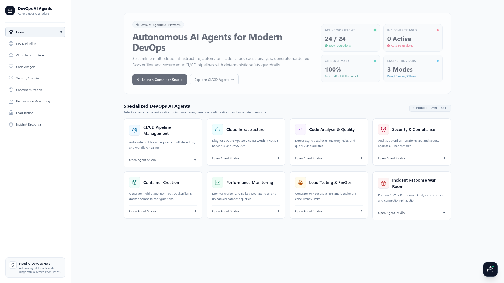
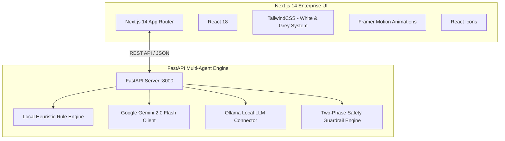

# 🤖 Autonomous DevOps AI Agents Platform 🚀

<div align="center">
  
</div>

<div align="center">

  
  
  
  
  
  
  
  
  [](LICENSE)
  [](https://github.com/prathamesh633/AI_Agents_For_DevOps/pulls)
  [](https://github.com/prathamesh633/AI_Agents_For_DevOps/graphs/commit-activity)
  
</div>

<p align="center">
  <b>🌟 Transform your DevOps workflow with Autonomous AI Agents 🌟</b>
  <br>
  <i>An enterprise-grade, multi-agent AI platform built to automate cloud infrastructure, diagnose CI/CD pipeline failures, audit security vulnerabilities, generate hardened Dockerfiles, and triage production incidents with deterministic safety guardrails.</i>
</p>

<div align="center">

[](https://github.com/prathamesh633/AI_Agents_For_DevOps/pulls)
[](LICENSE)
[](https://github.com/prathamesh633/AI_Agents_For_DevOps/stargazers)
[](https://github.com/prathamesh633/AI_Agents_For_DevOps/network/members)

</div>

---

## 📋 Table of Contents

- [✨ Core Capabilities](#-core-capabilities)
- [🤖 Specialized DevOps Agents](#-specialized-devops-agents)
- [🛠️ Technology Stack](#️-technology-stack)
- [🚀 Quick Start (Single Command)](#-quick-start-single-command)
- [🏗️ System Architecture](#️-system-architecture)
- [🧠 AI Engine & Safety Guardrails](#-ai-engine--safety-guardrails)
- [📸 Screenshots & Walkthrough](#-screenshots--walkthrough)
- [🤝 Contributing](#-contributing)
- [📄 License](#-license)
- [📞 Author & Support](#-author--support)

---

## ⚡ Quick Start (Single Command)

Get the complete platform running locally (both FastAPI Backend and Next.js Frontend) with a single command:

```bash
# 1. Clone the repository
git clone https://github.com/prathamesh633/AI_Agents_For_DevOps.git
cd AI_Agents_For_DevOps

# 2. Run the end-to-end local demo runner
python3 run_demo.py
```

### Manual Individual Service Setup

```bash
# Backend (FastAPI on Port 8000)
cd repo
pip install fastapi uvicorn pydantic requests
python3 backend_server.py

# Frontend (Next.js on Port 3000)
cd repo/devops-ai-agents
npm install
npm run dev
```

- 🌐 **Frontend UI:** [http://localhost:3000](http://localhost:3000)
- ⚙️ **Backend API:** [http://127.0.0.1:8000](http://127.0.0.1:8000)
- 📖 **Interactive Swagger Docs:** [http://127.0.0.1:8000/docs](http://127.0.0.1:8000/docs)

---

## ✨ Core Capabilities

- 🔒 **100% Free & Offline Mode Available** — Embedded Local Intelligent Heuristic Rule Engine requires zero API keys or cloud spend to run.
- ⚡ **Multi-Provider AI Switching** — Switch seamlessly between **Local Heuristic Engine**, **Google Gemini 2.0 Flash (Free API)**, and **Local Ollama**.
- 🛡️ **Two-Phase Deterministic Guardrails** — Every AI response differentiates between `[READ_ONLY]` inspections and `[REQUIRES_APPROVAL]` destructive operations.
- 🎨 **Modern White & Grey Enterprise Design** — High-contrast, clean UI system with soft-toned agent accents and clear semantic status indicators.
- 🎙️ **Multi-Modal Interaction** — Text, audio voice queries, and file attachments integrated into the global chat.

---

## 🤖 Specialized DevOps Agents

| Module | Route | Key Capabilities |
|---|---|---|
| 🐳 **Container Creation** | `/container-creation` | Generates hardened, multi-stage, non-root Dockerfiles and `docker-compose.yml` configurations with CIS benchmark compliance. |
| 🔄 **CI/CD Pipeline** | `/ci-cd` | Optimizes GitHub Actions/GitLab CI, automates dependency caching, heals failing jobs, and provides build intelligence. |
| ☁️ **Cloud Infrastructure** | `/cloud-infrastructure` | Diagnoses Azure App Service EasyAuth/SSO, VNet/DB boundaries, AWS IAM wildcard policies, and FinOps savings. |
| 🧪 **Code Analysis** | `/code-analysis` | Analyzes codebases for memory leaks, async deadlocks, unindexed database queries, and code smells. |
| 🔒 **Security Scanning** | `/security-scanning` | Runs SAST/SCA security audits, secret leakage detection, and CIS compliance benchmarks. |
| 📊 **Performance Monitoring** | `/performance-monitoring` | Real-time APM telemetry, p99 latency percentile histograms, and anomaly detection. |
| ⚡ **Load Testing & FinOps** | `/load-testing` | Generates k6 and Locust load-testing scenarios with concurrency benchmarking and cost projections. |
| 🚨 **Incident Response** | `/incident-response` | Live War Room with automated 5-Why Root Cause Analysis (RCA) and deterministic remediation runbooks. |

---

## 🛠️ Technology Stack



---

## 🧠 AI Engine & Safety Guardrails

Every agent response adheres to strict DevOps safety standards:

```json
{
  "agent_type": "container-creation",
  "provider_used": "Local Intelligent Heuristic Engine (Free & Offline)",
  "response": "...",
  "suggestions": [
    "Generate docker-compose.yml with reverse proxy",
    "Add multi-arch build command (amd64/arm64)",
    "Audit Dockerfile security with Trivy"
  ],
  "execution_plan": [
    "[READ_ONLY] fs_detect_project_framework() -> Next.js 14",
    "[READ_ONLY] dockerfile_lint_security_audit() -> PASSED (Non-root)",
    "[REQUIRES_APPROVAL] fs_write_file(path='./Dockerfile')"
  ],
  "safety_level": "REQUIRES_APPROVAL"
}
```

---

## 🤝 Contributing

Contributions are always welcome! Follow these steps to contribute:

1. **Fork the Repository**
2. **Create your Feature Branch**:
   ```bash
   git checkout -b feature/amazing-agent
   ```
3. **Commit your Changes**:
   ```bash
   git commit -m 'feat: Add Kubernetes auto-scaler agent'
   ```
4. **Push to Branch**:
   ```bash
   git push origin feature/amazing-agent
   ```
5. **Open a Pull Request** on [GitHub PRs](https://github.com/prathamesh633/AI_Agents_For_DevOps/pulls)

---

## 📄 License

This project is licensed under the **MIT License** — see the [LICENSE](LICENSE) file for details.

---

## 📞 Author & Support

<div align="center">

**Prathamesh Bhujade**

[](https://github.com/prathamesh633)
[](https://github.com/prathamesh633/AI_Agents_For_DevOps)

**[⭐ Star this Repository](https://github.com/prathamesh633/AI_Agents_For_DevOps) if you find it helpful!**

</div>
